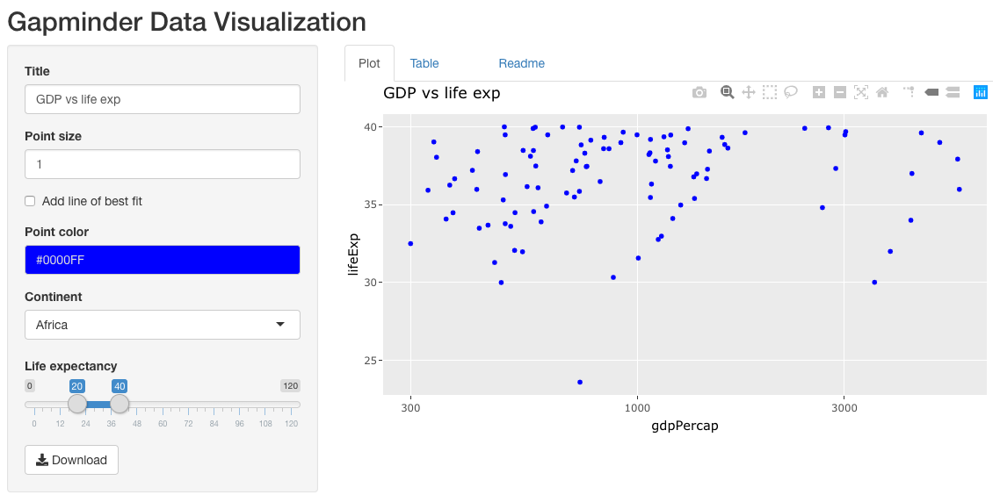
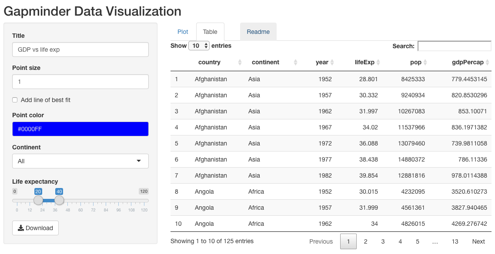

# Shiny_Application_and_Reproducible_Pitch

This is the Readme.

Part 1 of the project containes the following files:
- server.R
- ui.R
- Table.png
- Plot.png

Part 2 of the project containes the following files:
- Reproductible_patch.Rmd
- Reproductible_patch.html

My project contains 3 tabs:

1- Plot tab where you can select properties:

2- Table to view the dataset

3- Readme

By clicking the tab menu, you access to readme.

